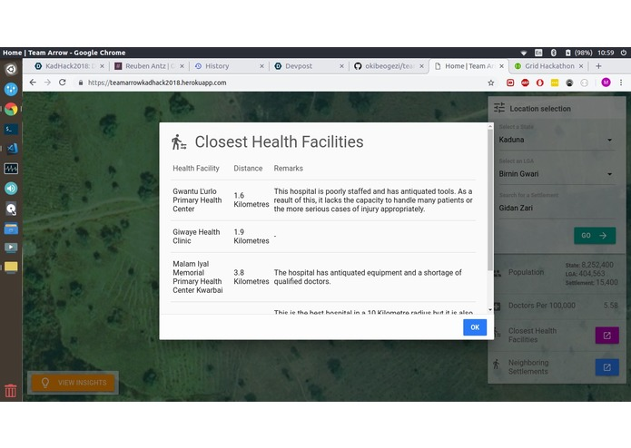

# [Outreach Insights](https://devpost.com/software/teamarrow) by Team Arrow for [KadHack 2018](http://colab.com.ng/2018/11/09/win-n1000000-kadhack2018-ehealth-colab-grid3/)

## Synopsis
Team Arrow's solution focuses on the health sector.
A basic tenet of economics is that resources are limited whilst human needs are basically infinite. In a country like Nigeria, this holds especially true. In the business of health, the consequences of these limted resources often prove fatal.

That was why we decided it would be beneficial for health agencies and organizations in the country to have a solution that would guide them to how to best impact the lives of people in rural communities in the most efficient way possible. Simply said, our solution aims to help doctors, nurses and other volunteers discover the best approach to helping improve healthcare in rural communties through immunization programs, outreaches, mobile clinics and other avenues.

Our solution makes use of datasets and APIs from Grid3 Nigeria, Google, and Wikipedia, turbo boosted using machine learning which allows the application to provide helpful insights into how to reach out to rural communities.

## Online Viewing
The application demo is available here https://teamarrowkadhack2018.herokuapp.com/

## Running Locally
To run the application locally, simply clone the repository, cd into it then start the nodejs server.
```bash
git clone https://github.com/okibeogezi/teamarrow.git
cd teamarrow
npm start
```

The server will start running on port 3000, Go to your browser and visit http://localhost:3000

## Screenshots
* *A list of the closest health facilities to the settlements and a few details about them*

---
* *Insights about the settlement in question; including what's been done well in the community as well as where improvements can be made*

---
* *Home screen*

---
* *Choosing the location to be queried*

---
* *After choosing a State, LGA and Settlement a query can be made*

---
* *The queried settlement Gidan Zari has been located and is highlighted*

---
* *A list of the neighbouring settlements*

